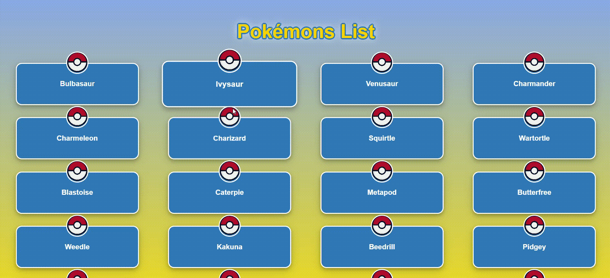

# React PokeApp

A simple React application that fetches and displays Pokémon data using the PokeAPI. The app consists of two pages:

1. **PokemonsList** - Displays a list of Pokémon names.
2. **PokemonPage** - Shows detailed information about a selected Pokémon.
***

## Features

- Fetches data from the [PokeAPI](https://pokeapi.co/api/v2/pokemon/).
- Uses React Router for navigation between the list and details page.
- Axios for API requests.
- React Router for navigation.
***

## Demo


***

## Technologies Used

- `React` - library for creating interactive user interfaces.
- `Vite` - fast tool for building and serving web apps. 
- `TypeScript` - superset of JavaScript with type checking.
- `Axios` - library for making HTTP requests.
- `React Router` - manages navigation between pages in a React app.
- `CSS` - styles web pages.
***

## Setup

1. Clone the repo:
   ```bash
   git clone https://github.com/gubskaia/react-pokeapp.git

2. Install dependencies:
   ```bash
   cd react-pokeapp
   npm install

3.  Run the development server:
   ```bash
    npm run dev